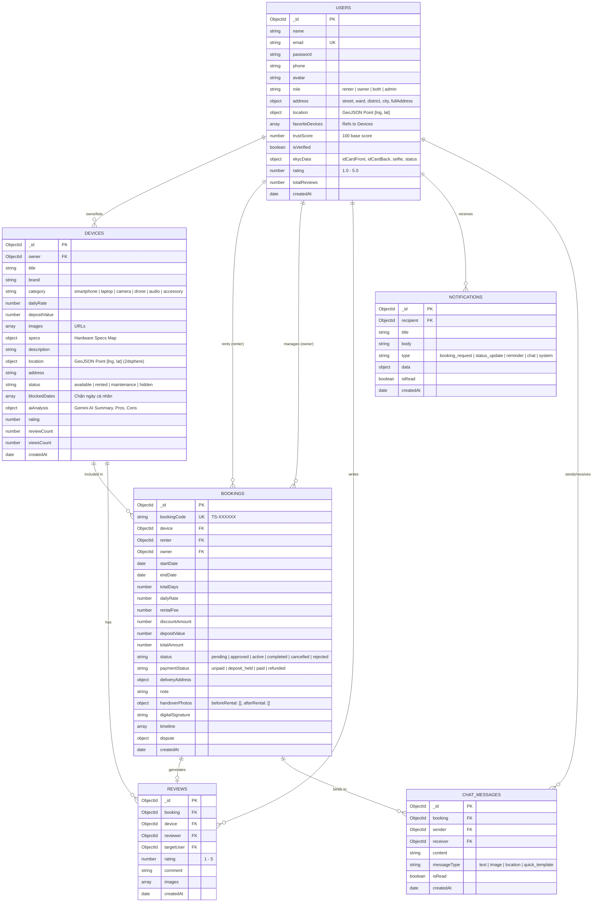

# THIẾT KẾ CƠ SỞ DỮ LIỆU MONGODB CHUẨN - DỰ ÁN TECHSHARE WEB
## NỀN TẢNG CSDL NOSQL MONGODB ATLAS CHO ỨNG DỤNG WEB FULLSTACK (MERN)

---

### 1. TỔNG QUAN KIẾN TRÚC DỮ LIỆU (MONGODB UNIFIED DATABASE)

Toàn bộ hệ thống Web **TechShare** sử dụng **MongoDB (MongoDB Atlas)** làm cơ sở dữ liệu duy nhất:
- **Cloud Database**: MongoDB Atlas Replica Set phân tán, tự động sao lưu và hỗ trợ sharding linh hoạt.
- **ODM (Object Data Modeling)**: Mongoose ODM trên Node.js/Express Server với schema validation nghiêm ngặt, middleware hooks và virtual getters.
- **Tối ưu hóa Địa lý (Geospatial Index)**: Tận dụng chỉ mục không gian `2dsphere` và chuẩn tọa độ GeoJSON `Point [kinh độ (lng), vĩ độ (lat)]` để xử lý các truy vấn tìm kiếm thiết bị quanh vị trí người dùng qua `react-leaflet` trên trình duyệt.
- **Chuẩn hóa Khóa chính & Tham chiếu (`_id: ObjectId`)**:
  - Mọi collection đều sử dụng khóa chính `_id: ObjectId`.
  - Tham chiếu giữa các bảng (`owner`, `device`, `renter`, `booking`,...) đều dùng kiểu `mongoose.Schema.Types.ObjectId` kèm thuộc tính `ref`.
  - Cấu hình `{ toJSON: { virtuals: true }, toObject: { virtuals: true } }` kích hoạt getter virtual `id` (chuỗi hex 24 ký tự) tương thích linh hoạt cho Web Client (ReactJS Axios) và Redux Toolkit / React Query.
- **Chiến lược Bộ nhớ đệm & Lưu trữ Web (Web Caching Strategy)**:
  - Phía Web Client, các dữ liệu tĩnh hoặc bán tĩnh (danh mục, lịch sử tìm kiếm, giỏ hàng/wishlist tạm thời) được lưu đệm tại `localStorage`.
  - Phía Server và Client đồng bộ trạng thái thời gian thực thông qua kênh **Socket.io** (Chat tin nhắn, thông báo chuông, cập nhật trạng thái đơn hàng).



---

## 2. ĐẶC TẢ CHI TIẾT CÁC SCHEMAS TRONG MONGODB

### 2.1. Collection: `users`
Lưu trữ thông tin người dùng, tài khoản phân quyền, trạng thái eKYC, điểm tín nhiệm Trust Score và vị trí tọa độ địa lý.

```javascript
import mongoose from 'mongoose';

const userSchema = new mongoose.Schema(
  {
    name: {
      type: String,
      required: [true, 'Họ và tên là bắt buộc'],
      trim: true,
      minlength: 2,
      maxlength: 60,
    },
    email: {
      type: String,
      required: [true, 'Email là bắt buộc'],
      unique: true,
      lowercase: true,
      trim: true,
      match: [/^\w+([.-]?\w+)*@\w+([.-]?\w+)*(\.\w{2,3})+$/, 'Email không hợp lệ'],
    },
    password: {
      type: String,
      required: [true, 'Mật khẩu là bắt buộc'],
      minlength: 6,
      select: false, // Ẩn mật khẩu khi query trừ khi gọi .select('+password')
    },
    phone: {
      type: String,
      trim: true,
      default: '',
    },
    avatar: {
      type: String,
      default: 'https://images.unsplash.com/photo-1535713875002-d1d0cf377fde?w=400',
    },
    role: {
      type: String,
      enum: ['renter', 'owner', 'both', 'admin'],
      default: 'both',
    },
    address: {
      street: { type: String, default: '' },
      ward: { type: String, default: '' },
      district: { type: String, default: '' },
      city: { type: String, default: 'Hà Nội' },
      fullAddress: { type: String, default: 'Hà Nội, Việt Nam' },
    },
    location: {
      type: {
        type: String,
        enum: ['Point'],
        default: 'Point',
      },
      coordinates: {
        type: [Number], // [kinh độ (lng), vĩ độ (lat)]
        default: [105.7826, 21.0285],
      },
    },
    favoriteDevices: [
      {
        type: mongoose.Schema.Types.ObjectId,
        ref: 'Device',
      },
    ],
    trustScore: {
      type: Number,
      default: 100,
      min: 0,
      max: 200,
    },
    isVerified: {
      type: Boolean,
      default: false,
    },
    ekycData: {
      idCardFront: { type: String, default: '' },
      idCardBack: { type: String, default: '' },
      selfie: { type: String, default: '' },
      status: {
        type: String,
        enum: ['none', 'pending', 'approved', 'rejected'],
        default: 'none',
      },
      submittedAt: { type: Date },
      verifiedAt: { type: Date },
      rejectionReason: { type: String, default: '' },
    },
    rating: {
      type: Number,
      default: 5.0,
      min: 1.0,
      max: 5.0,
    },
    totalReviews: {
      type: Number,
      default: 0,
    },
  },
  {
    timestamps: true,
    toJSON: {
      virtuals: true,
      transform: (doc, ret) => {
        delete ret.password;
        delete ret.__v;
        return ret;
      },
    },
    toObject: { virtuals: true },
  }
);

userSchema.index({ email: 1 }, { unique: true });
userSchema.index({ location: '2dsphere' });
export const User = mongoose.model('User', userSchema);
```

---

### 2.2. Collection: `devices`
Lưu trữ thông tin chi tiết thiết bị cho thuê, toạ độ địa lý GeoJSON phục vụ bản đồ Web `react-leaflet`, lịch bận cá nhân và kết quả phân tích review từ Google Gemini AI.

```javascript
const deviceSchema = new mongoose.Schema(
  {
    owner: {
      type: mongoose.Schema.Types.ObjectId,
      ref: 'User',
      required: true,
      index: true,
    },
    title: {
      type: String,
      required: [true, 'Tên thiết bị là bắt buộc'],
      trim: true,
      index: 'text',
    },
    brand: {
      type: String,
      required: [true, 'Thương hiệu là bắt buộc'],
      trim: true,
      index: true,
    },
    category: {
      type: String,
      required: [true, 'Danh mục thiết bị là bắt buộc'],
      enum: ['smartphone', 'laptop', 'camera', 'drone', 'audio', 'accessory'],
      index: true,
    },
    dailyRate: {
      type: Number,
      required: [true, 'Giá thuê mỗi ngày là bắt buộc'],
      min: [10000, 'Giá thuê tối thiểu là 10.000 VNĐ/ngày'],
      index: true,
    },
    depositValue: {
      type: Number,
      required: [true, 'Tiền đặt cọc là bắt buộc'],
      min: 0,
    },
    images: {
      type: [String],
      required: [true, 'Phải có ít nhất 1 ảnh thiết bị'],
      validate: [val => val.length > 0, 'Phải tải lên ít nhất 1 ảnh'],
    },
    specs: {
      type: Map,
      of: String,
      default: {}, // Ví dụ: { "Chip": "Apple M3 Max", "RAM": "36GB", "Camera": "48MP" }
    },
    description: {
      type: String,
      required: [true, 'Mô tả thiết bị là bắt buộc'],
      index: 'text',
    },
    location: {
      type: {
        type: String,
        enum: ['Point'],
        default: 'Point',
      },
      coordinates: {
        type: [Number], // [lng, lat]
        required: true,
      },
    },
    address: {
      type: String,
      required: true,
    },
    status: {
      type: String,
      enum: ['available', 'rented', 'maintenance', 'hidden'],
      default: 'available',
      index: true,
    },
    blockedDates: [
      {
        type: Date, // Các ngày chủ máy chủ động chặn không cho thuê
      },
    ],
    rating: {
      type: Number,
      default: 5.0,
      min: 1.0,
      max: 5.0,
    },
    reviewCount: {
      type: Number,
      default: 0,
    },
    aiAnalysis: {
      summary: { type: String, default: '' },
      pros: [{ type: String }],
      cons: [{ type: String }],
      rentalRecommendation: { type: String, default: '' },
      analyzedAt: { type: Date },
    },
    viewsCount: {
      type: Number,
      default: 0,
    },
  },
  {
    timestamps: true,
    toJSON: {
      virtuals: true,
      transform: (doc, ret) => {
        delete ret.__v;
        return ret;
      },
    },
    toObject: { virtuals: true },
  }
);

deviceSchema.index({ location: '2dsphere' });
deviceSchema.index({ category: 1, dailyRate: 1, status: 1 });
export const Device = mongoose.model('Device', deviceSchema);
```

---

### 2.3. Collection: `bookings`
Quản lý vòng đời đơn thuê từ lúc gửi yêu cầu đến khi duyệt, bàn giao qua mã QR, đối soát ảnh trước/sau, ký số điện tử và giải quyết tranh chấp (Dispute).

```javascript
const bookingSchema = new mongoose.Schema(
  {
    bookingCode: {
      type: String,
      unique: true,
      required: true,
      index: true,
    },
    device: {
      type: mongoose.Schema.Types.ObjectId,
      ref: 'Device',
      required: true,
      index: true,
    },
    renter: {
      type: mongoose.Schema.Types.ObjectId,
      ref: 'User',
      required: true,
      index: true,
    },
    owner: {
      type: mongoose.Schema.Types.ObjectId,
      ref: 'User',
      required: true,
      index: true,
    },
    startDate: {
      type: Date,
      required: true,
    },
    endDate: {
      type: Date,
      required: true,
    },
    totalDays: {
      type: Number,
      required: true,
      min: 1,
    },
    dailyRate: {
      type: Number,
      required: true,
    },
    rentalFee: {
      type: Number,
      required: true,
    },
    discountAmount: {
      type: Number,
      default: 0,
    },
    depositValue: {
      type: Number,
      required: true,
      default: 0,
    },
    totalAmount: {
      type: Number,
      required: true,
    },
    status: {
      type: String,
      enum: ['pending', 'approved', 'active', 'completed', 'cancelled', 'rejected'],
      default: 'pending',
      index: true,
    },
    paymentStatus: {
      type: String,
      enum: ['unpaid', 'deposit_held', 'paid', 'refunded'],
      default: 'unpaid',
    },
    deliveryAddress: {
      recipientName: { type: String, required: true },
      phone: { type: String, required: true },
      address: { type: String, required: true },
    },
    note: {
      type: String,
      default: '',
    },
    handoverPhotos: {
      beforeRental: [{ type: String }], // Ảnh lúc nhận máy
      afterRental: [{ type: String }],  // Ảnh lúc trả máy
    },
    digitalSignature: {
      type: String, // Data URL base64 chữ ký số qua canvas
      default: '',
    },
    timeline: [
      {
        status: { type: String, required: true },
        updatedAt: { type: Date, default: Date.now },
        note: { type: String, default: '' },
      },
    ],
    dispute: {
      isDisputed: { type: Boolean, default: false },
      reason: { type: String, default: '' },
      requestedAmount: { type: Number, default: 0 },
      proofPhotos: [{ type: String }],
      resolutionStatus: {
        type: String,
        enum: ['none', 'pending', 'resolved_owner_compensated', 'resolved_renter_refunded', 'resolved_partial'],
        default: 'none',
      },
      adminNote: { type: String, default: '' },
      resolvedAt: { type: Date },
    },
  },
  {
    timestamps: true,
    toJSON: {
      virtuals: true,
      transform: (doc, ret) => {
        delete ret.__v;
        return ret;
      },
    },
    toObject: { virtuals: true },
  }
);

bookingSchema.index({ renter: 1, status: 1, createdAt: -1 });
bookingSchema.index({ owner: 1, status: 1, createdAt: -1 });
bookingSchema.index({ device: 1, startDate: 1, endDate: 1 });
export const Booking = mongoose.model('Booking', bookingSchema);
```

---

### 2.4. Collection: `reviews`
Lưu trữ nhận xét, đánh giá 2 chiều (khách đánh giá thiết bị & chủ máy, chủ máy đánh giá ý thức khách).

```javascript
const reviewSchema = new mongoose.Schema(
  {
    booking: {
      type: mongoose.Schema.Types.ObjectId,
      ref: 'Booking',
      required: true,
      unique: true,
    },
    device: {
      type: mongoose.Schema.Types.ObjectId,
      ref: 'Device',
      required: true,
      index: true,
    },
    reviewer: {
      type: mongoose.Schema.Types.ObjectId,
      ref: 'User',
      required: true,
    },
    targetUser: {
      type: mongoose.Schema.Types.ObjectId,
      ref: 'User',
      required: true,
      index: true,
    },
    rating: {
      type: Number,
      required: true,
      min: 1,
      max: 5,
    },
    comment: {
      type: String,
      required: [true, 'Nội dung nhận xét là bắt buộc'],
      maxlength: 1000,
    },
    images: [{ type: String }],
  },
  {
    timestamps: true,
    toJSON: { virtuals: true },
    toObject: { virtuals: true },
  }
);

export const Review = mongoose.model('Review', reviewSchema);
```

---

### 2.5. Collection: `notifications`
Lưu trữ thông báo hệ thống và push trực tiếp tới Web Client qua Socket.io.

```javascript
const notificationSchema = new mongoose.Schema(
  {
    recipient: {
      type: mongoose.Schema.Types.ObjectId,
      ref: 'User',
      required: true,
      index: true,
    },
    title: {
      type: String,
      required: true,
    },
    body: {
      type: String,
      required: true,
    },
    type: {
      type: String,
      enum: ['booking_request', 'booking_approved', 'booking_cancelled', 'reminder', 'chat', 'system'],
      default: 'system',
    },
    data: {
      bookingId: { type: mongoose.Schema.Types.ObjectId, ref: 'Booking' },
      deviceId: { type: mongoose.Schema.Types.ObjectId, ref: 'Device' },
      link: { type: String, default: '' },
    },
    isRead: {
      type: Boolean,
      default: false,
      index: true,
    },
  },
  {
    timestamps: true,
    toJSON: { virtuals: true },
    toObject: { virtuals: true },
  }
);

notificationSchema.index({ recipient: 1, isRead: 1, createdAt: -1 });
export const Notification = mongoose.model('Notification', notificationSchema);
```

---

### 2.6. Collection: `chat_messages`
Lưu trữ tin nhắn trao đổi thời gian thực giữa Renter và Owner theo từng đơn hàng.

```javascript
const chatMessageSchema = new mongoose.Schema(
  {
    booking: {
      type: mongoose.Schema.Types.ObjectId,
      ref: 'Booking',
      required: true,
      index: true,
    },
    sender: {
      type: mongoose.Schema.Types.ObjectId,
      ref: 'User',
      required: true,
    },
    receiver: {
      type: mongoose.Schema.Types.ObjectId,
      ref: 'User',
      required: true,
    },
    content: {
      type: String,
      required: true,
      trim: true,
    },
    messageType: {
      type: String,
      enum: ['text', 'image', 'location', 'quick_template'],
      default: 'text',
    },
    isRead: {
      type: Boolean,
      default: false,
    },
  },
  {
    timestamps: true,
    toJSON: { virtuals: true },
    toObject: { virtuals: true },
  }
);

chatMessageSchema.index({ booking: 1, createdAt: 1 });
export const ChatMessage = mongoose.model('ChatMessage', chatMessageSchema);
```

---

## 3. TRUY VẤN MONGODB NÂNG CAO PHỤC VỤ ỨNG DỤNG WEB

### 3.1. Tìm kiếm thiết bị theo bán kính tọa độ (`$nearSphere`)
Phục vụ màn hình **Bản đồ Web (`react-leaflet`)**:

```javascript
export const getNearbyDevices = async (latitude, longitude, maxDistanceMeters = 20000) => {
  return await Device.find({
    status: 'available',
    location: {
      $nearSphere: {
        $geometry: {
          type: 'Point',
          coordinates: [Number(longitude), Number(latitude)], // GeoJSON [lng, lat]
        },
        $maxDistance: maxDistanceMeters,
      },
    },
  })
    .populate('owner', 'name avatar phone rating isVerified')
    .select('title brand category dailyRate depositValue images location address rating reviewCount');
};
```

### 3.2. Truy vấn ngăn ngừa trùng lịch đơn thuê (Conflict-free Booking Query)
Khi người dùng chọn khoảng ngày trên Web DateRangePicker:

```javascript
export const checkDeviceAvailability = async (deviceId, startDate, endDate) => {
  const existingBooking = await Booking.findOne({
    device: deviceId,
    status: { $in: ['approved', 'active'] },
    $or: [
      { startDate: { $lte: new Date(endDate) }, endDate: { $gte: new Date(startDate) } },
    ],
  });

  return !existingBooking; // true nếu máy còn trống
};
```
