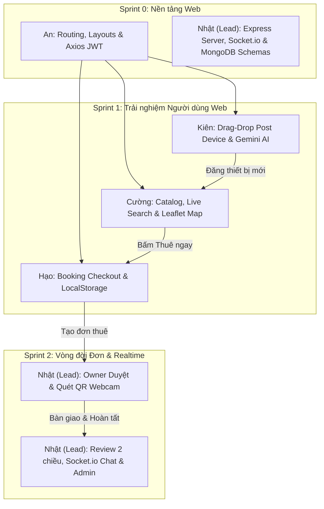

# 👥 BẢNG PHÂN CHIA TÍNH NĂNG NHÓM 5 THÀNH VIÊN (PHIÊN BẢN WEB)
## DỰ ÁN TECHSHARE WEB - NỀN TẢNG CHO THUÊ THIẾT BỊ CÔNG NGHỆ & TRỢ LÝ GEMINI AI
> **Kiến trúc**: Fullstack MERN (MongoDB Atlas, Express.js, React.js 18+ Vite, Node.js) + Socket.io + Google Gemini AI  
> **Quy mô**: 5 Thành viên (**An, Cường, Hạo, Kiên, Nhật (Lead)**)  
> **Tài liệu tham chiếu**: [FEATURES.md](file:///E:/Repository/tech-share-web/docs/FEATURES.md), [DATABASE_DESIGN.md](file:///E:/Repository/tech-share-web/docs/DATABASE_DESIGN.md), [ISSUES.md](file:///E:/Repository/tech-share-web/docs/ISSUES.md)

---

## 📌 QUY ƯỚC ĐỘ ƯU TIÊN (PRIORITY LEVELS)

- 🔴 **P0 (Critical / Core MVP)**: Bắt buộc hoàn thành đầu tiên. Là các tính năng sống còn để hệ thống Web chạy thông luồng từ React Client ➔ Express API ➔ MongoDB Atlas.
- 🟡 **P1 (High / Key Feature)**: Nghiệp vụ cốt lõi hoàn thiện vòng đời thuê, giải quyết bài toán chống gian lận, đối soát ảnh và giao tiếp realtime.
- 🟢 **P2 (Medium / Value-Added & Wow Factor)**: Các tính năng thông minh mở rộng (Gemini AI Consultant, Ký số Canvas, Biểu đồ thống kê Recharts, Gamification), giúp website đạt chuẩn thương mại chuyên nghiệp.

---

## 📊 TỔNG QUAN PHÂN BỔ NHIỆM VỤ 5 THÀNH VIÊN

| STT | Thành viên | Vai trò kỹ thuật | Luồng tính năng phụ trách (Cohesive Web Flow) | Số tính năng | Tỷ trọng |
| :---: | :--- | :--- | :--- | :---: | :---: |
| **1** | **An** | **Web Architect & Security Engineer** | **Hệ thống Routing, Master Layouts, Định danh, Hồ sơ & eKYC Tín nhiệm** | 8 tính năng | 20% |
| **2** | **Cường** | **Frontend Engineer (Catalog & Web Maps)** | **Khám phá Danh mục, Tìm kiếm tức thì & Bản đồ Không gian Địa lý Web** | 8 tính năng | 20% |
| **3** | **Hạo** | **Frontend Engineer (Booking & Checkout)** | **Quy trình Đặt thuê, Vòng đời Đơn hàng, QR Bàn giao & Bộ nhớ đệm** | 8 tính năng | 20% |
| **4** | **Kiên** | **Fullstack & AI Engineer** | **Đăng tin Cho thuê (Drag-Drop), Quản lý Kho máy & Trợ lý Gemini AI Hub** | 8 tính năng | 20% |
| **5** | **Nhật (Lead)** | **Team Leader & Operations/Backend Lead** | **Vận hành Đơn, Đánh giá 2 chiều, Socket.io Realtime Chat & Admin Portal** | 8 tính năng | 20% |

---

## 1. THÀNH VIÊN 1: AN
### 🏛️ Luồng phụ trách: ROUTING, MASTER LAYOUTS, ĐỊNH DANH, HỒ SƠ & E-KYC TÍN NHIỆM
> **Mục tiêu luồng**: Xây dựng kiến trúc React Router v6 với hệ thống 4 Master Layouts thích ứng màn hình, bảo mật JWT session và luồng định danh eKYC quét CCCD cùng ảnh selfie qua Webcam.

| Mã | Tên tính năng | Mô tả chi tiết trên Web | Trang / Component Web | Backend API & DB | Độ ưu tiên |
| :---: | :--- | :--- | :--- | :--- | :---: |
| **A-01** | **Bộ khung Router & 4 Master Layouts** | Cấu hình React Router v6: `PublicLayout` (Navbar/Footer), `DashboardLayout` (Sidebar), `AdminLayout`, `AuthLayout`; Responsive Desktop/Mobile. | `AppRoutes.tsx`, `PublicLayout.tsx`, `DashboardLayout.tsx` | - | 🔴 **P0** |
| **A-02** | **Đăng ký tài khoản (Register Page)** | Form đăng ký: Họ tên, Email, Mật khẩu, SĐT; kiểm tra hợp lệ Formik/React Hook Form + Yup; mã hóa `bcryptjs`, gán role kép `both`. | `RegisterPage.tsx`, `RegisterForm.tsx` | `POST /api/auth/register`<br>`User` Model | 🔴 **P0** |
| **A-03** | **Đăng nhập & Phiên JWT (Login Page)** | Xác thực đăng nhập, sinh JWT Token, lưu `localStorage`, Axios Interceptor tự gắn header Bearer Token cho mọi request bảo mật. | `LoginPage.tsx`, `authSlice.ts` | `POST /api/auth/login`<br>`authMiddleware.js` | 🔴 **P0** |
| **A-04** | **Hồ sơ Cá nhân (Profile Page)** | Xem & cập nhật thông tin cá nhân, đổi avatar, cập nhật địa chỉ giao nhận mặc định. | `ProfilePage.tsx`, `AddressCard.tsx` | `GET /api/auth/me`<br>`PUT /api/auth/profile` | 🔴 **P0** |
| **A-05** | **Landing Page Hero & Feature Showcase** | Hero banner ấn tượng, cam kết nền tảng, số liệu tin cậy (thay thế Onboarding di động). | `LandingHeroSection.tsx`, `ValueProps.tsx` | Cục bộ Web Client | 🟡 **P1** |
| **A-06** | **Bảo mật Phiên & Đổi mật khẩu** | Đổi mật khẩu bảo mật, cơ chế "Ghi nhớ đăng nhập" (Remember Me) và Đăng xuất xóa sạch dữ liệu phiên an toàn. | `ChangePasswordModal.tsx`, `tokenUtils.ts` | `POST /api/auth/change-password` | 🟢 **P2** |
| **A-07** | **Xác minh Danh tính eKYC qua Web** | Kéo thả tải 2 mặt CCCD và chụp ảnh chân dung selfie trực tiếp qua Webcam trình duyệt để xin cấp Tích xanh (`isVerified`). | `EkycVerificationPage.tsx`, `WebcamCapture.tsx` | `POST /api/auth/ekyc`<br>`User.ekycData` | 🟡 **P1** |
| **A-08** | **Thẻ Điểm Tín nhiệm (Trust Score)** | Hiển thị điểm tín nhiệm (thang 100), lịch sử cộng/trừ điểm và tự động chiết khấu giảm cọc khi người dùng có điểm uy tín cao. | `TrustScoreCard.tsx` (trong Profile) | `GET /api/users/:id/trust-score`<br>`User.trustScore` | 🟢 **P2** |

---

## 2. THÀNH VIÊN 2: CƯỜNG
### 🔍 Luồng phụ trách: KHÁM PHÁ DANH MỤC, TÌM KIẾM ĐA TIÊU CHÍ & BẢN ĐỒ WEB LEAFLET
> **Mục tiêu luồng**: Giúp người dùng lướt xem hàng ngàn thiết bị công nghệ qua lưới sản phẩm hiện đại, bộ lọc tìm kiếm tức thì và bản đồ địa lý tương tác toàn màn hình không tốn phí bản quyền.

| Mã | Tên tính năng | Mô tả chi tiết trên Web | Trang / Component Web | Backend API & DB | Độ ưu tiên |
| :---: | :--- | :--- | :--- | :--- | :---: |
| **C-01** | **Trang chủ & Thanh 6 Danh mục** | Giao diện Home gồm thanh tìm kiếm nổi, Banner carousel ưu đãi, thanh cuộn 6 danh mục chuẩn với icon SVG sắc nét. | `HomePage.tsx`, `CategoryBar.tsx` | `GET /api/devices` (query category)<br>`Device` Model | 🔴 **P0** |
| **C-02** | **Lưới Thiết bị Thông minh (Device Grid)** | Hiển thị danh sách thiết bị dạng lưới 3-4 cột (Desktop): Ảnh thumbnail, Tên máy, Giá/ngày, Rating sao, Nút Quick View và Thả tim. | `DeviceCard.tsx`, `DeviceGrid.tsx` | `GET /api/devices?page=1&limit=12` | 🔴 **P0** |
| **C-03** | **Chi tiết Thiết bị Chuẩn TMĐT** | Album ảnh xem trước phóng to (Lightbox Modal), Bảng thông số kỹ thuật động (Dynamic Specs), thông tin chủ máy và chính sách cọc. | `DeviceDetailPage.tsx`, `SpecsTable.tsx` | `GET /api/devices/:id`<br>`populate('owner')` | 🔴 **P0** |
| **C-04** | **Tìm kiếm Tức thì (Live Search Debounce)** | Ô tìm kiếm với debounce 400ms, dropdown hiển thị kết quả khớp ngay lập tức, từ khóa hot thịnh hành và lịch sử tìm gần nhất. | `LiveSearchBar.tsx`, `SearchDropdown.tsx` | `GET /api/devices?keyword=...` (text index) | 🔴 **P0** |
| **C-05** | **Bộ lọc Sidebar Đa tiêu chí (Multi-Filter)** | Bộ lọc nâng cao: Dual Slider khoảng giá, chọn nhiều thương hiệu (Apple, Sony, Canon...), bán kính GPS và sắp xếp đa chiều. | `FilterSidebar.tsx`, `PriceRangeSlider.tsx` | `GET /api/devices?minPrice=&maxPrice=&brand=&sort=` | 🟡 **P1** |
| **C-06** | **Bản đồ Tương tác Web (React-Leaflet)** | Tích hợp thư viện `react-leaflet` (OpenStreetMap miễn phí), xin quyền vị trí trình duyệt (Web Geolocation) hiển thị thiết bị lân cận. | `ExploreMapPage.tsx`, `LeafletMapContainer.tsx` | `GET /api/devices/nearby`<br>MongoDB `$nearSphere` | 🔴 **P0** |
| **C-07** | **Custom Marker & Popover Thẻ Máy** | Marker ghim bản đồ màu sắc theo từng danh mục; nhấp Marker mở thẻ Popover tóm tắt (ảnh, giá thuê, khoảng cách, nút xem chi tiết). | `CustomMarker.tsx`, `DeviceMapPopover.tsx` | Tọa độ GeoJSON `Point [lng, lat]` | 🟡 **P1** |
| **C-08** | **Gom cụm Marker Bản đồ (Clustering)** | Tự động gom cụm các ghim gần nhau thành vòng tròn số lượng khi zoom out bản đồ, đảm bảo mượt mà không giật lag. | `ClusteredMapView.tsx` (Leaflet.markercluster) | Thuật toán Marker Clustering | 🟢 **P2** |

---

## 3. THÀNH VIÊN 3: HẠO
### 📦 Luồng phụ trách: QUY TRÌNH ĐẶT THUÊ, VÒNG ĐỜI ĐƠN HÀNG & BÀN GIAO MÃ QR
> **Mục tiêu luồng**: Xây dựng trải nghiệm đặt thuê thông minh với DateRangePicker trực quan chống trùng lịch, tự động tính chiết khấu thuê dài ngày, quản lý tiến trình đơn và giao nhận qua mã QR điện tử.

| Mã | Tên tính năng | Mô tả chi tiết trên Web | Trang / Component Web | Backend API & DB | Độ ưu tiên |
| :---: | :--- | :--- | :--- | :--- | :---: |
| **H-01** | **Trang Đặt thuê & Date Range Picker** | Chọn ngày nhận và ngày trả trên giao diện lịch tương tác; tự động bôi xám và khóa các ngày máy đã có người đặt trước. | `BookingCheckoutPage.tsx`, `WebDatePicker.tsx` | `POST /api/bookings`<br>`Booking` Model | 🔴 **P0** |
| **H-02** | **Bảng Tính Chi phí & Voucher Tự động** | Tự động tính số ngày thuê, chiết khấu thuê dài ngày (>=3 ngày giảm 10%, >=7 ngày giảm 20%), tiền cọc và trừ mã giảm giá voucher. | `OrderSummaryCard.tsx`, `VoucherField.tsx` | Logic tính giá `bookingController.js` | 🔴 **P0** |
| **H-03** | **Quản lý Đơn của tôi (My Bookings Hub)** | Giao diện bảng quản lý đơn cá nhân phân 5 tab: Chờ duyệt (`pending`), Đã duyệt (`approved`), Đang thuê (`active`), Đã xong, Đã hủy. | `MyBookingsPage.tsx`, `BookingTableRow.tsx` | `GET /api/bookings/my-bookings` | 🔴 **P0** |
| **H-04** | **Chi tiết Đơn & Timeline Tiến độ** | Xem chi tiết hợp đồng đơn thuê, sơ đồ Timeline từng bước tiến độ, địa chỉ giao nhận và nút Hủy đơn khi còn `pending`. | `BookingDetailPage.tsx`, `OrderTimelineStepper.tsx` | `GET /api/bookings/:id`<br>`PATCH /api/bookings/:id/cancel` | 🔴 **P0** |
| **H-05** | **Đồng hồ Đếm ngược & Gia hạn Thuê** | Huy hiệu đếm ngược số ngày/giờ thuê còn lại; modal gửi đề xuất gia hạn thêm ngày thuê trực tiếp tới chủ máy. | `RentalCountdownBadge.tsx`, `ExtensionModal.tsx` | `POST /api/bookings/:id/extend` | 🟡 **P1** |
| **H-06** | **Mã QR Bàn giao & Tải ảnh lúc nhận** | Xuất trình mã QR đơn hàng (`qrcode.react`) để chủ máy quét; tải ảnh 4 góc máy lúc nhận bàn giao (`handoverPhotos.beforeRental`). | `HandoverQrModal.tsx`, `HandoverPhotoDropzone.tsx` | `PATCH /api/bookings/:id/handover-renter` | 🟡 **P1** |
| **H-07** | **Trang Yêu thích & Bộ đệm LocalStorage** | Trang Wishlist quản lý danh sách máy đã thả tim; tự động đồng bộ CSDL và lưu đệm vào `localStorage` xem ngay khi mạng chập chờn. | `WishlistPage.tsx`, `FavoriteButton.tsx` | `POST /api/users/favorites/:deviceId`<br>`localStorage` | 🟡 **P1** |
| **H-08** | **Banner Mất kết nối & Lưu đơn Nháp** | Hiển thị banner thông báo khi mất mạng Internet; cho phép lưu thông tin đơn thuê nháp cục bộ và tự đồng bộ lại khi online. | `OfflineNoticeBanner.tsx`, `draftBookingQueue.ts` | Web `navigator.onLine` listener | 🟢 **P2** |

---

## 4. THÀNH VIÊN 4: KIÊN
### 🤖 Luồng phụ trách: ĐĂNG TIN CHO THUÊ (DRAG-DROP), KHO MÁY & GEMINI AI HUB
> **Mục tiêu luồng**: Cung cấp bộ công cụ đăng tin kéo thả ảnh trực quan cho chủ máy, quản lý kho thiết bị, lịch bận cá nhân và khai thác tối đa sức mạnh của mô hình Google Gemini AI.

| Mã | Tên tính năng | Mô tả chi tiết trên Web | Trang / Component Web | Backend API & DB | Độ ưu tiên |
| :---: | :--- | :--- | :--- | :--- | :---: |
| **K-01** | **Form Đăng tin Cho thuê (Post Device)** | Form nhiều bước: Tên máy, danh mục, hãng, giá thuê/ngày, tiền cọc, mô tả và bảng thông số kỹ thuật tùy biến (Specs Map Builder). | `PostDevicePage.tsx`, `SpecsBuilderForm.tsx` | `POST /api/devices`<br>`Device` Model | 🔴 **P0** |
| **K-02** | **Kéo thả Tải ảnh (Drag-Drop) & Ghim Vị trí** | Kéo thả tải lên tối đa 8 ảnh thực tế (`react-dropzone`), xem trước thumbnail; nhấp chọn vị trí máy trên bản đồ con để lấy tọa độ GeoJSON. | `DragDropImageUploader.tsx`, `LocationPickerMap.tsx` | `location.coordinates` GeoJSON `Point` | 🔴 **P0** |
| **K-03** | **Quản lý Kho máy của tôi (My Devices)** | Bảng quản lý toàn bộ thiết bị sở hữu, số lượt đã cho thuê, điểm rating sao và công tắc nhanh đổi trạng thái (`available`/`maintenance`/`hidden`). | `MyDevicesPage.tsx`, `StatusSwitch.tsx` | `GET /api/devices/my-devices`<br>`PATCH /api/devices/:id/status` | 🔴 **P0** |
| **K-04** | **Lịch bận Cá nhân (Availability Calendar)** | Giao diện lịch tháng cho phép chủ máy nhấp chọn các ngày cá nhân cần dùng máy để khóa lịch, không cho khách thuê đặt vào các ngày đó. | `OwnerAvailabilityCalendar.tsx` | `PATCH /api/devices/:id/blocked-dates`<br>`Device.blockedDates` | 🟡 **P1** |
| **K-05** | **Báo cáo Doanh thu & Thống kê Kho (Recharts)** | Biểu đồ cột/đường doanh thu theo tuần, tháng, quý; thống kê tỷ lệ máy cho thuê (utilization rate) và lịch sử tiền thuê nhận được. | `OwnerAnalyticsPage.tsx`, `RevenueBarChart.tsx` | `GET /api/devices/owner/analytics` | 🟡 **P1** |
| **K-06** | **AI Review Summarizer (Google Gemini AI)** | Gọi Google Gemini 1.5 Flash SDK phân tích thông số máy thành 3 thẻ trực quan: Thẻ xanh Ưu điểm (Pros), Thẻ đỏ Nhược điểm (Cons), Lời khuyên mục đích thuê. | `AiReviewSummaryCard.tsx`, `ProsConsWidget.tsx` | `POST /api/ai/summarize-review`<br>`@google/generative-ai` | 🔴 **P0** |
| **K-07** | **AI Device Comparator (So sánh 2 Thiết bị)** | Chọn 2 máy từ kho dữ liệu, Gemini AI lập bảng so sánh đối đầu chi tiết: cấu hình, cảm biến, pin, cân nặng và chỉ số Hiệu năng / Giá thuê. | `AiDeviceComparePage.tsx`, `ComparisonTable.tsx` | `POST /api/ai/compare`<br>`gemini-1.5-flash` | 🟡 **P1** |
| **K-08** | **AI Rental Consultant & AI Listing Assistant** | Chatbot tư vấn thuê máy theo nhu cầu tự nhiên của khách; nút "Tạo mô tả bằng AI" tự động soạn nội dung bài đăng chuẩn SEO cho chủ máy. | `AiChatbotWidget.tsx`, `AiGenerateDescriptionBtn.tsx` | `POST /api/ai/consultant`<br>`POST /api/ai/generate-description` | 🟢 **P2** |

---

## 5. THÀNH VIÊN 5: NHẬT (LEAD)
### ⚙️ Luồng phụ trách: VẬN HÀNH ĐƠN, ĐÁNH GIÁ 2 CHIỀU, SOCKET.IO CHAT & ADMIN PORTAL
> **Mục tiêu luồng**: Điều phối toàn bộ dự án, hoàn thiện quy trình duyệt đơn, quét QR qua Webcam, đối soát ảnh nhận/trả máy, kênh chat thời gian thực qua Socket.io, ví ký quỹ nội bộ và cổng quản trị tối cao Admin Hub.

| Mã | Tên tính năng | Mô tả chi tiết trên Web | Trang / Component Web | Backend API & DB | Độ ưu tiên |
| :---: | :--- | :--- | :--- | :--- | :---: |
| **N-01** | **Xử lý Đơn phía Chủ máy (Approval Hub)** | Xem danh sách khách gửi yêu cầu thuê kèm điểm uy tín; nút bấm Duyệt (`approved`) hoặc Từ chối (`rejected`) kèm nhập lý do. | `OwnerOrderApprovalPage.tsx`, `ApprovalActionModal.tsx` | `PATCH /api/bookings/:id/status`<br>`status: approved/rejected` | 🔴 **P0** |
| **N-02** | **Quét QR Webcam & Đối soát Ảnh Trả máy** | Sử dụng webcam trình duyệt (`html5-qrcode`) quét mã QR của khách kích hoạt đơn `active`; tải ảnh sau thuê (`handoverPhotos.afterRental`) và Hoàn tất. | `WebcamQrScannerModal.tsx`, `CompleteReturnModal.tsx` | `PATCH /api/bookings/:id/handover-owner`<br>`PATCH /api/bookings/:id/complete` | 🔴 **P0** |
| **N-03** | **Khiếu nại Hư hỏng & Trừ cọc (Damage Dispute)** | Nếu máy hư hỏng sau thuê, chủ máy lập biên bản khiếu nại đính kèm ảnh trước/sau và số tiền đề xuất bồi thường để chuyển Admin phân xử. | `DamageDisputeModal.tsx`, `DisputeDetailsCard.tsx` | `POST /api/bookings/:id/dispute`<br>`Booking.dispute` | 🟡 **P1** |
| **N-04** | **Hệ thống Đánh giá 2 chiều (Review & Rating)** | Khách chấm 1-5 sao máy & chủ máy (kèm ảnh thật); Chủ máy chấm điểm ý thức khách; tự động cập nhật trung bình sao trên CSDL. | `ReviewModal.tsx`, `ReviewListSection.tsx` | `POST /api/reviews`<br>`Review` Model | 🔴 **P0** |
| **N-05** | **Nhắn tin Trực tiếp Thời gian thực (Socket.io Chat)** | Khung chat 1-1 giữa Renter và Owner theo từng mã đơn thuê: tin nhắn văn bản, gửi ảnh, mẫu tin nhắn nhanh, hiển thị trạng thái đã xem. | `LiveChatPage.tsx`, `ChatDrawer.tsx` | `Socket.io Events`<br>`ChatMessage` Model | 🟡 **P1** |
| **N-06** | **Trung tâm Thông báo Đẩy Web (Notification Hub)** | Chuông thông báo trên thanh Header với chấm đỏ số lượng chưa đọc; nhận thông báo tức thì qua Socket.io khi có sự kiện đơn hàng. | `NotificationDropdown.tsx`, `NotificationBadge.tsx` | `GET /api/notifications`<br>`PATCH /api/notifications/:id/read` | 🔴 **P0** |
| **N-07** | **Ví Ký quỹ Nội bộ Mock (Escrow Wallet)** | Quản lý số dư khả dụng và tiền cọc đang đóng băng (Escrow); tự động hoàn cọc khi đơn hoàn tất; xem bảng lịch sử giao dịch. | `EscrowWalletPage.tsx`, `TransactionTable.tsx` | `GET /api/wallet/me`<br>`POST /api/wallet/topup` | 🟢 **P2** |
| **N-08** | **Cổng Quản trị Admin Toàn sàn (Admin Portal)** | Dashboard phân tích số liệu toàn sàn; kiểm duyệt bài đăng; màn hình đối chiếu song song 2 ảnh trước/sau để xử lý tranh chấp cọc; duyệt eKYC. | `AdminPortalPage.tsx`, `DisputeResolverModal.tsx` | `GET /api/admin/analytics`<br>`DELETE /api/admin/devices/:id` | 🟡 **P1** |

---

## 🔗 MA TRẬN TÍCH HỢP DỮ LIỆU GIỮA 5 THÀNH VIÊN TRÊN WEB



### Các điểm giao tiếp dữ liệu cốt lõi:
1. **An ➔ Toàn nhóm**: Cung cấp `authSlice` và Axios Interceptor tự động gắn Bearer Token; mọi request gọi API private của các thành viên còn lại đều kế thừa middleware này.
2. **Kiên ➔ Cường**: Thiết bị do Kiên đăng (`POST /api/devices`) sẽ xuất hiện tức thì trên Lưới sản phẩm và Bản đồ Leaflet do Cường phụ trách (`GET /api/devices`).
3. **Cường ➔ Hạo**: Nút "Thuê ngay" trên trang chi tiết máy của Cường sẽ chuyển hướng người dùng sang trang checkout của Hạo kèm `deviceId` và thông số giá.
4. **Hạo ➔ Nhật**: Đơn thuê do Hạo tạo (`POST /api/bookings`) sẽ kích hoạt sự kiện Socket.io gửi tới Nhật (Owner) để duyệt và mở webcam quét QR khi gặp mặt.
5. **Nhật ➔ Kiên & Cường**: Khi đơn hoàn tất và có Review mới, hệ thống tự động cập nhật số sao trung bình trên Card sản phẩm của Cường và biểu đồ thống kê của Kiên.

---

## 📅 KẾ HOẠCH TRIỂN KHAI 4 SPRINT (MILESTONES WEB)

```
Tuần 1 (Sprint 0): Khung Dự án, CSDL & Master Layouts (P0)
├── An: Cấu hình Vite React TS, Tailwind CSS, React Router v6, 4 Master Layouts
├── Nhật (Lead): Khởi tạo Express Server, kết nối MongoDB Atlas, Mongoose Models, Socket.io Server
└── Cả nhóm: Thống nhất chuẩn RESTful API Request/Response & Socket Events

Tuần 2 (Sprint 1): Tính năng Khám phá, Tìm kiếm & Đăng tin Kéo thả (P0 + P1)
├── An: Đăng ký, Đăng nhập (JWT), Profile cá nhân, Landing Hero
├── Cường: Trang chủ 6 danh mục, Live Search Debounce 400ms, Bản đồ Leaflet GPS
└── Kiên: Đăng tin máy mới (Drag-Drop ảnh, Ghim bản đồ), Quản lý kho máy của tôi

Tuần 3 (Sprint 2): Quy trình Đặt thuê, Vận hành & Trí tuệ Nhân tạo AI (P0 + P1)
├── Hạo: Tạo đơn thuê với DateRangePicker, tính cọc/voucher, My Bookings Hub
├── Kiên: Gemini AI Tóm tắt Review (Pros/Cons), So sánh 2 thiết bị công nghệ
└── Nhật (Lead): Chủ máy duyệt đơn, Quét QR qua Webcam, Đánh giá 2 chiều

Tuần 4 (Sprint 3): Tính năng Nâng cao, Realtime & Admin Portal (P1 + P2)
├── An: eKYC quét CCCD 2 mặt & Chụp webcam selfie, Thẻ điểm tín nhiệm Trust Score
├── Cường: Phân cụm ghim bản đồ (Marker Clustering), Bộ lọc Sidebar đa tiêu chí
├── Hạo: Đồng hồ đếm ngược thời gian thuê, Hợp đồng ký số điện tử Canvas
├── Kiên: Chatbot Gemini AI tư vấn thuê máy, Báo cáo doanh thu Recharts
├── Nhật (Lead): Chat 1-1 Socket.io, Chuông thông báo realtime, Admin Portal giải quyết tranh chấp
└── Cả nhóm: Kiểm thử E2E, diễn tập kịch bản demo Web 15 phút
```
